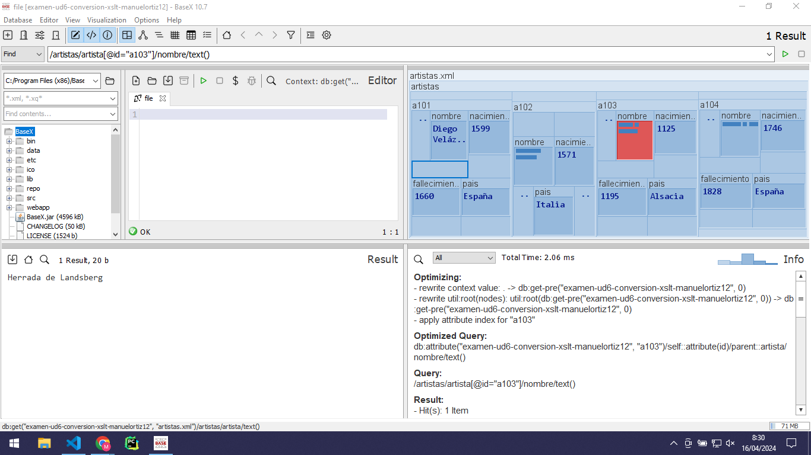
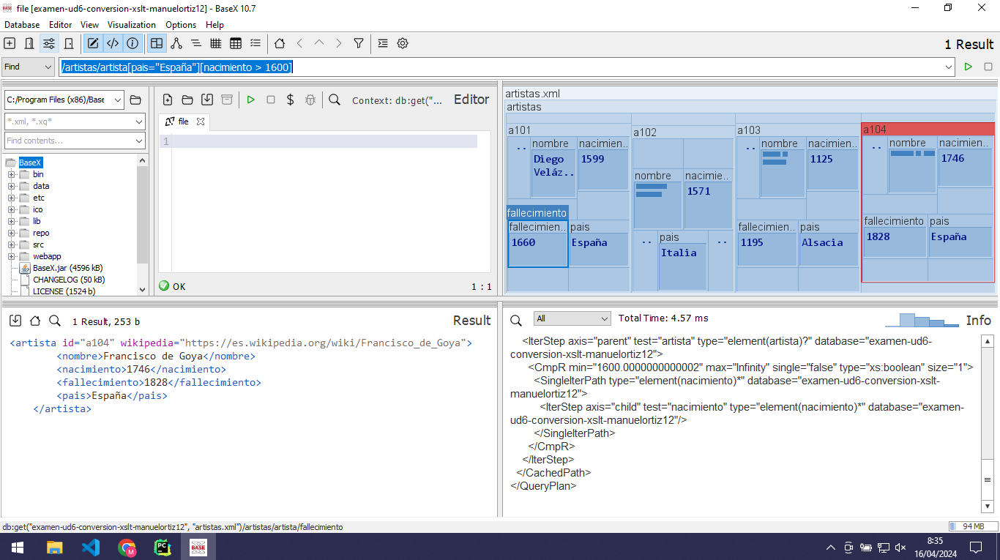
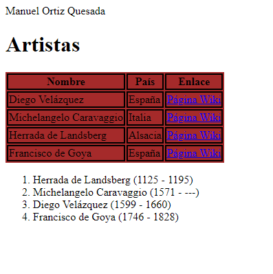

# Examen UD6. Conversión XSLT

Clona este repositorio y realiza los siguientes ejercicios. Como siempre, responde sobre el README con imágenes y ficheros DEBIDAMENTE ENLAZADOS.


## Ejercicio 1. XPath

Abre en BaseX el siguiente [XML](artistas.xml) e indica las expresiones XPath para obtener los siguientes datos:

- El nombre sin etiquetas del artista con id "a103"
  - pantallazo del resultado
    
  - expresión XPath
    ```/artistas/artista[@id="a103"]/nombre/text()```
- Toda la información de los artistas españoles y con fecha de nacimiento posterior a 1600
  - pantallazo del resultado
    
  - expresión XPath
    ```/artistas/artista[pais="España"][nacimiento > 1600]```
## Ejercicio 2. XSLT

En Visual Studio Code, y sin asistentes IA ni ayudas externas

Transforma el siguiente [XML](artistas.xml). 
El resultado debe ser un documento "index.html" con las siguientes características:
- El título contendrá en este orden apellidos y nombre
- Usa la etiqueta style dentro de head para aplicar las reglas CSS
    - Cambia algún color de fondo
    - Aplica borde a las tablas
- Crea una lista de artistas ordenada por año de nacimiento. 
  - Muestra el nombre y entre paréntesis, el año de nacimiento y fallecimiento
  - En caso de no existir, se sustituye el año de fallecimiento por "----"
- Crea una tabla de artistas con las siguientes columnas
  - Nombre
  - País 
  - Enlace. Será un enlace a la wikipedia    

Envía:
- un pantallazo de la transformación resultante
  
- fichero [salida.html](salida.html)
- [salida.xsl](salida.xsl)

## Git
Realiza las entregas con el formato adecuado en Markdown y mediante comandos git. Entrega un pantallazo de los últimos comandos realizados para la subida

