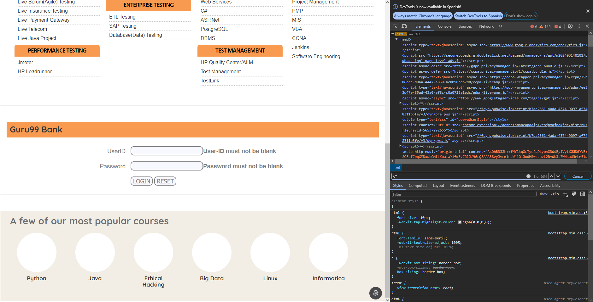
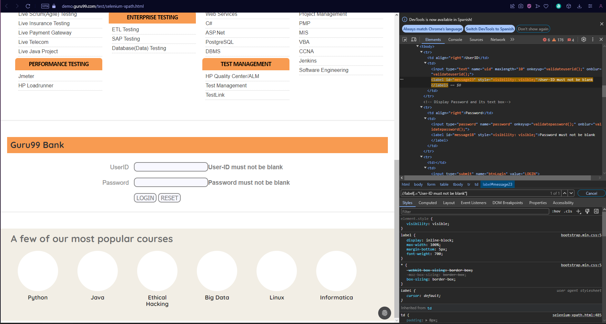

#  UD6 A1. Conversiones. XPath

XML Path Language (XPath) es un lenguaje de expresión que permite el procesamiento de valores conforme al modelo de datos definido en el modelo de datos XQuery y XPath.
XPath permite referir partes de un documento  XML.

## XPath en la W3C

XPath fue creado para su uso en el estándar XSLT,  para seleccionar y examinar la estructura del documento de entrada de la transformación. XPath fue definido por el consorcio W3C. La última versión fue publicada en 2017. [Aquí](https://www.w3.org/TR/xpath/) se muestran las distintas versiones definidas a lo largo de los años
- 2017-03-21	Recommendation	XML Path Language (XPath) 3.1

- 2014-04-08	Recommendation	XML Path Language (XPath) 3.0

- 2010-12-14	Recommendation	XML Path Language (XPath) 2.0 (Second Edition)

- 1999-11-16	Recommendation	XML Path Language (XPath) Version 1.0

## Modelo de datos en XPath: Árbol del documento

XPath considera un documento XML como un [árbol de nodos](https://www.mclibre.org/consultar/xml/lecciones/xml-xpath.html#arbol-documento). En Informática, un árbol es una estructura de datos que equivale a un árbol matemático. En Matemáticas un árbol es un caso particular de grafo. Los siguientes términos definidos en teoría de grafos se utilizan también en Informática y en XPath:
- Un **árbol dirigido** es un grafo en el que cualquier pareja de vértices están conectada por un único camino y en el que las aristas tienen dirección y todos los nodos menos uno tienen un único padre.
- El nodo raíz es el único nodo sin padre. 
- Los nodos hermanos son los nodos que tienen el mismo padre.
- Los nodos descendientes de un nodo son todos los nodos a los que se llega desde el nodo: los hijos, los hijos de los hijos, etc.
- Los nodos ascendientes de un nodo son todos los nodos de los que un nodo es descendiente: el padre, el padre del padre, etc.

### Tipos de nodos
Un documento XML puede representarse como un árbol dirigido, considerando por ejemplo los elementos como nodos y que un elemento es padre de los elementos que contiene. Pero en XPath no sólo los elementos son nodos, en realidad hay siete tipos de nodos:
- Raíz
- Elemento
- Atributo
- Texto
- Comentario
- Instrucción de procesamiento
- Espacio de nombres

## Vídeo Qué es XPath. How to create XPath for Beginners

Visualiza el siguiente  [vídeo](https://youtu.be/U-MZJ6rbqi4) sobre XPath
- rutas absolutas/relativas
- @atributo
- [Métodos](https://www.guru99.com/xpath-selenium.html) 
  - cotains()
  - text()
  - starts-with()
  - or, and
  
## Sintaxis de la expresiones XPath

Una expresión XPath es una cadena de texto que representa un recorrido en el árbol del documento.

Evaluar una expresión XPath es buscar si hay nodos en el documento que se ajustan al recorrido definido en la expresión. El resultado de la evaluación son todos los nodos que se ajustan a la expresión. Para poder evaluar una expresión XPath, el documento debe estar bien formado.

Las expresiones XPath se pueden escribir de dos formas distintas:

- sintaxis abreviada: más compacta y fácil de leer
- sintaxis completa: más larga pero con más opciones disponibles

Las expresiones XPath se pueden dividir en pasos de búsqueda. Cada paso de búsqueda se puede a su vez dividir en tres partes:

- eje: selecciona nodos elemento o atributo basándose en sus nombres.
- predicado: restringe la selección del eje a que los nodos cumplan ciertas condiciones.
- selección de nodos: de los nodos seleccionados por el eje y predicado, selecciona los elementos, el texto que contienen o ambos.

Visualiza los ejemplos en [www.mclibre.org](https://www.mclibre.org/consultar/xml/lecciones/xml-xpath.html#sintaxis-abreviada)

## XPath en los navegadores

Los selectores XPath pueden ser evaluados y validados  en las herramientas del navegador (F12). Para ello puedes usar: 
- El panel de elementos, que permite copiar la expresión XPath de un elemento y realizar su [búsqueda](https://stackoverflow.com/a/22573161)
- La consola, usando la función  [ $x(path [, startNode])](https://developer.chrome.com/docs/devtools/console/utilities/#xpath-function) que devuelve los valores seleccionados por el selector XPath.

Aquí hay un [artículo](https://yizeng.me/2014/03/23/evaluate-and-validate-xpath-css-selectors-in-chrome-developer-tools/) que detalla ambas aproximaciones 

## Tarea 1
En esta página hay un [formulario](https://demo.guru99.com/test/selenium-xpath.html) con el que vamos a practicar las expresiones XPath.

Abre las herramientas del navegador y entrega los pantallazos de los siguientes accesos desde consola. Marca la expresión XPath usada en cada caso:
- Selecciona todos los inputs
  
- Selecciona el elemento submit
- 
- Selecciona el  elemento reset
- 
- Selecciona todos los label
- 
- Selecciona todos los elementos del documento //*
- 
- Selecciona el elemento con contenido "User-ID must not be blank"
- 

## Tarea 2 
Abre el [XPath Tester - Evaluator](https://www.freeformatter.com/xpath-tester.html#ad-output) y envía pantallazos del ejemplo particularizado con un actor y un cantante de tu propia cosecha.

1. 
2. 
3. 
4. 
5. 
6. 
7. 
8. 
9. 
10. 
11. 
12. 
13. 
14. 
15. 
16. 
17. 
18. 
19. 
20. 
21. 

De interés
- [Qué es el lenguaje XPath (ticArte)](https://www.ticarte.com/contenido/que-es-el-lenguaje-xpath)
- [XPath Tester - Evaluator (freeformatter)](https://www.freeformatter.com/xpath-tester.html#ad-output)
- [XPath: Introducción (dlsi.ua.es, 6:11)](https://youtu.be/gsikl5FBEXg)
- [XPath: Ejemplo (dlsi.ua.es, 3:12)](https://youtu.be/Cx-r_VU_eu8)
