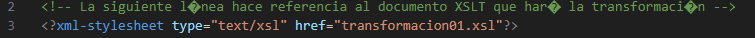

# UD6 A3 Conversiones. XSLT


## XSLT 

Stylesheets Transformation. 
XSLT se fija en la transformación de documentos XML. El proceso es el siguiente:


## Proceso de transformación

El proceso de transformación puede llevarse a cabo de distintas formas:

1. En el servidor Web
2. En el cliente Web
3. En una aplicación de escritorio

### Transformación desde el servidor. Extensión Live server en Visual Studio Code

Nosotros vamos a utilizar la extensión Live Server en Visual Studio Code. Es una herramienta que permite lanzar un servidor de desarrollo local para previsualizar en el navegador lo que estamos escribiendo en nuestro editor de código.


Una vez instalada la extensión, abre el fichero .xml con el .xsl asociado desde la barra del editor. Si todo está correcto el fichero se muestra transformado.

## Ejemplos
Abre  desde la extensión Live server en Visual Studio Code los ejemplos que se adjuntan en este repositorio. Usa el navegador Opera. 

Envía los pantallazos que lo demuestre. Para ello introduce la etiqueta title con tu nombre y apellidos.

Responde a las siguientes preguntas:
1. Son 6 ficheros xml que se transforman. Indica cuáles de ellos se transforman en fichero html.

- Ej1 -> No se transforma
- Ej2 -> Si se transforma
- Ej3 -> Si se transforma
- Ej4 -> Si se transforma
- Ej5 -> Si se transforma
- Ej6 -> Si se transforma

2. La transformación se realiza asociándolos a una hoja de estilo distinta. Indica cómo se vincula cada fichero .xml a su hoja de transformación

- Ej1 -> No se transforma
- Ej2


- Ej3
  
- Ej4
  
- Ej5

- Ej6
  


3. De las hojas de estilo indica cuántas son ficheros .xml bien formados

- Ej1 -> Bien formado
- Ej2 -> Bien formado
- Ej3 -> Bien formado
- Ej4 -> Bien formado
- Ej5 -> Bien formado
- Ej6 -> Bien formado
  

4. Indica el elemento raíz de un fichero hoja de estilo .xsl
```
<stylesheet xmlns:xsl="http://www.w3.org/1999/XSL/Transform" version="2.0">
```

5. Busca la etiqueta output y analízala
   
Nos da la información del arhivo después de la transformación, tipo de codificación, omitir la declaración html, etc.

6. Encuentra la etiqueta "xsl:template". Analiza en qué parte del documento aparece y con qué contexto

En este caso, la etiqueta ```<xsl:template>``` está definiendo la plantilla principal para la transformación. La expresión match="/", dentro de la etiqueta ```<xsl:template>```, indica que esta plantilla se aplicará cuando el proceso de transformación encuentre el nodo raíz del documento XML de entrada (/).


7. Indica un listado de las etiquetas xsl: que aparecen en los documentos .xsl e intenta explicar su uso
   
   ```<xsl:for-each>```

   Uso: Permite iterar sobre un conjunto de nodos seleccionados en el documento XML de entrada.

   ```<xsl:value-of>```

   Uso: Se utiliza para extraer el valor de un nodo XML y añadirlo a la salida transformada (por ejemplo, a un elemento HTML).

   ```<xsl:sort>```

   Uso: Permite ordenar los elementos seleccionados en una iteración, basándose en el valor de un atributo o nodo.

   ```<xsl:text>```

   Uso: Permite insertar texto literal en la salida transformada, incluso si contiene caracteres especiales de XML o HTML.

   ```<xsl:if>```

   Uso: Permite realizar una condición y ejecutar cierto bloque de código si la condición es verdadera.

   ```<xsl:choose>```
   ```<xsl:when>```
   ```<xsl:otherwise>```

   Uso: Se utilizan juntos para implementar una estructura de control de flujo similar a una declaración switch o case en otros lenguajes.


8. Crea y entrega una plantilla de fichero .xsl 
   [Plantilla](plantilla/plantilla.xsl)


De interés
- [XSLT en mclibre](https://www.mclibre.org/consultar/xml/otros/clase.html)
- [XPATH en mclibre](https://www.mclibre.org/consultar/xml/lecciones/xml-xpath.html) 
- [XSLT Transformation Online Tool](https://www.online-toolz.com/tools/xslt-transformation.php)
- [www.freeformatter.com. XSL Transformer - XSLT](https://www.freeformatter.com/xsl-transformer.html)
- [Ejemplo de transformación con hoja de estilos XSL. José Luis Cruz](https://youtu.be/fGtlVYgppOM)
- [XSL. María Jesús Lamarca Lapuente](http://www.hipertexto.info/documentos/xsl.htm)
- [XPath y BaseX (II). Universidad.xml](https://youtu.be/WL6IfVvL0kc)
- [Tareas 1º DAM/DAW e-learning - Tarea 5 - Lenguaje de marcas #7 - Datos primer empleado (parte 1)](https://youtu.be/HRPnntyVZ0w)
- [Tareas 1º DAM/DAW e-learning - Tarea 5 - Lenguaje de marcas #11 - Mostrando artistas en xsl](https://youtu.be/9PQTcbFmSmQ)
