# UD7 A1. xQuery

XQuery es un lenguaje de consulta diseñado para colecciones de datos XML. Es semánticamente similar a SQL, aunque incluye algunas capacidades de programación.

XQuery 1.0 fue desarrollado por el grupo de trabajo de Consulta XML del W3C. El trabajo fue estrechamente coordinado con el desarrollo de XSLT 2.0 por el Grupo de trabajo XSL; los dos grupos compartieron la responsabilidad del XPath 2.0, que es un subconjunto de XQuery 1.0. XQuery 3.1 es una recomendación de la W3C del 21 de Marzo de 2017.

JSON es un formato de intercambio de datos ligero que se usa ampliamente para intercambiar datos en la web y para almacenar datos en bases de datos. Muchas aplicaciones usan JSON junto con XML y HTML. XQuery 3.1 amplía XQuery para admitir tanto JSON como XML, agrega mapas y matrices al modelo de datos y los admite con nuevas expresiones en el lenguaje y nuevas funciones.


## Ejemplos de uso

XQuery se puede utilizar para:

- Extraer información para usar en un Servicio Web
- Generar informes resumidos
- Transformar datos XML  
- Buscar documentos web para obtener información relevante

## Herramientas
El motor XQuery puede ser un software que permite realizar consultas contra un fichero XML.

BaseX es una base de datos XML nativa y una herramienta de procesamiento de documentos XML. Este software  de código abierto y multiplataforma proporciona un motor de consulta completo para XPath, XQuery y XSLT.

Algunos resultados en BaseX no estarán correctamente identados. Si queremos forzar una correcta identación para facilitar la lectura del resultado, se debe añadir la siguiente instrucción en la primera línea de la consulta:

```console
declare option output:indent "yes";
```

## Expresiones FLWOR. 
Las consultas XQuery pueden estar formadas por cinco tipos de cláusulas diferentes, lo que se llama la norma FLWOR.
Las expresiones FLWOR toman su nombre de los 5 tipos de sentencias de las que pueden estar compuestas: FOR, LET, WHERE, ORDER BY y RETURN.

En una sentencia FLWOR al menos ha de existir una cláusula [FOR](https://mp0373-lmsxi.vercel.app/docs/unidades/06/contenidos/xquery/sintaxis/clausulas/for) o una [LET](https://mp0373-lmsxi.vercel.app/docs/unidades/06/contenidos/xquery/sintaxis/clausulas/let); el resto, si
existen, han de respetar escrupulosamente el orden dado por el nombre, FLWOR.
Con estas sentencias se consigue buena parte de la funcionalidad que diferencia a XQuery de
XPath. Entre otras cosas permite construir el documento que será la salida de la sentencia.

## Funciones y operadores

XQuery, XPath  y XSLT comparten la misma biblioteca de funciones [XPath and XQuery Functions and Operators 3.1]( https://www.w3.org/TR/xpath-functions-31/)
Dichas funciones y [operadores](https://mp0373-lmsxi.vercel.app/docs/unidades/06/contenidos/xquery/sintaxis/operadores) tienen distintos ámbitos: matemáticos, de cadenas de texto, para  el tratamiento de expresiones regulares,  para comparar fechas y horas,  booleanas,  para manipular URIs...
En XQuery, las funciones se utilizan para realizar operaciones específicas que devuelven un resultado.

XQuery incluye una amplia variedad de [funciones integradas](https://mp0373-lmsxi.vercel.app/docs/unidades/06/contenidos/xquery/sintaxis/funciones/funciones-xquery) para procesar y manipular datos, pero también permite definir [funciones propias](https://mp0373-lmsxi.vercel.app/docs/unidades/06/contenidos/xquery/sintaxis/funciones/definicion-funciones) y funciones dependientes del entorno de ejecución del motor XQuery.

## Consultas XQuery
Las consultas XQuery se pueden escribir directamente en un software que implemente un **motor XQuery**, el cual permita realizar consultas contra un fichero XML.

### Ficheros de consultas
Como alternativa, las consultas también se pueden almacenar en ficheros para su uso posterior o reutilización. Para ello, debemos crear un fichero de texto, escribir la consulta en el fichero y guardarlo con alguna de las siguientes extensiones:

- `.xq`
- `.xqm`
- `.xqy`
- `.xql`
- `.xqu`
- `.xquery`

Por ejemplo, podemos crear un fichero de texto llamado consulta.xq que contenga lo siguiente:

```
for $libro in /biblioteca/libros/libro
return $libro/titulo
```


## Actividades
Realiza las siguientes [actividades](https://mp0373-lmsxi.vercel.app/docs/unidades/06/ejercicios/601) y entrega de cada apartado al menos 2 ficheros de consulta junto con su xml, el resultado y su pantallazo, todo en el mismo README. El fichero de consulta será lo suficientemente complejo y contendrá el enunciado como comentario. 
Debes personalizar el xml para que aparezca tu nombre y apellidos en el resultado de la consulta y en  los pantallazos
Define una función original e invócala. Envía un pantallazo 

Entregas
- 601 -> [xml](ejercicios/601/601.xml)
  - [consulta1](ejercicios/601/consulta601.1)
  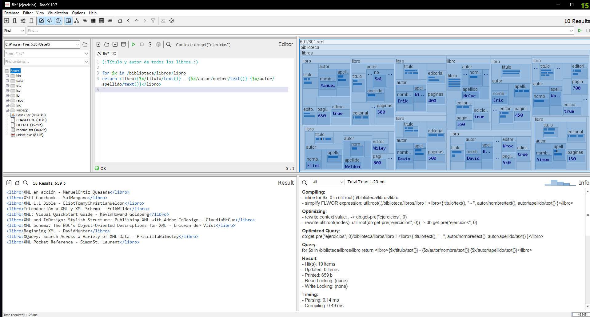
  - [consulta2](ejercicios/601/consulta601.2)
  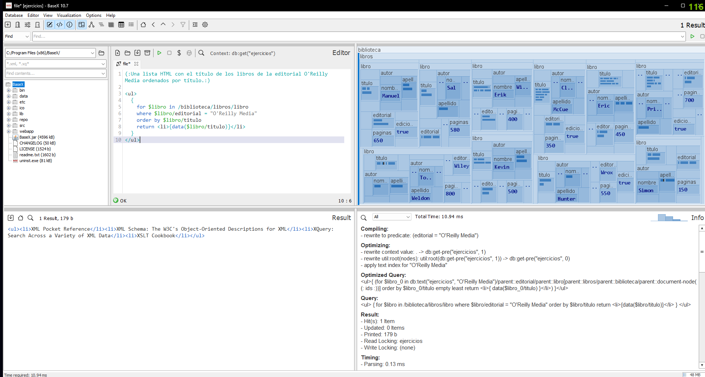
- 602 -> [xml](ejercicios/602/602.xml)
  - [consulta1](ejercicios/602/consulta602.1)
    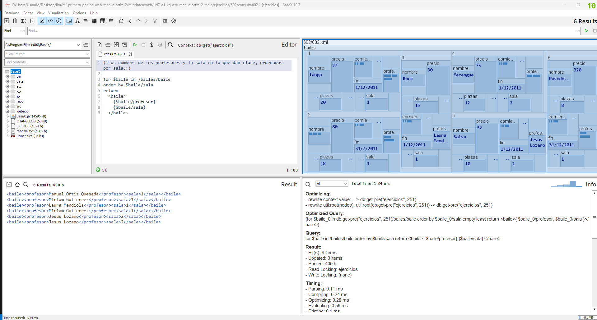
  - [consulta2](ejercicios/602/consulta602.2)
    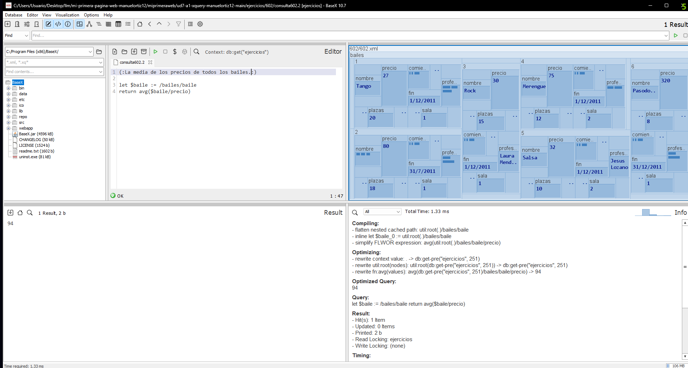
- 603 -> [xml](ejercicios/603/603.xml)
  - [consulta1](ejercicios/603/consulta603.1)
    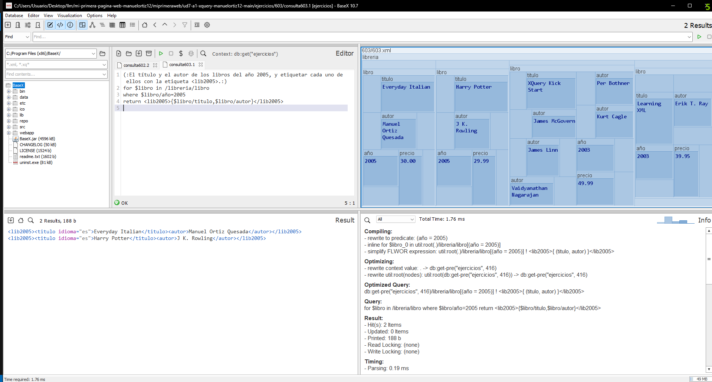
  - [consulta2](ejercicios/603/consulta603.2)
    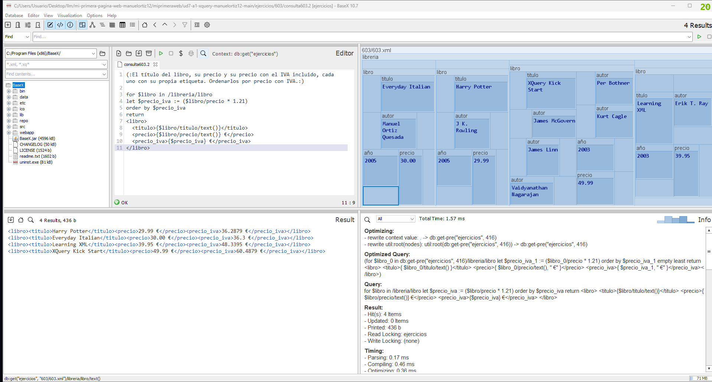
- 604 -> [xml](ejercicios/604/604.xml)
  - [consulta1](ejercicios/604/consulta604.1)
    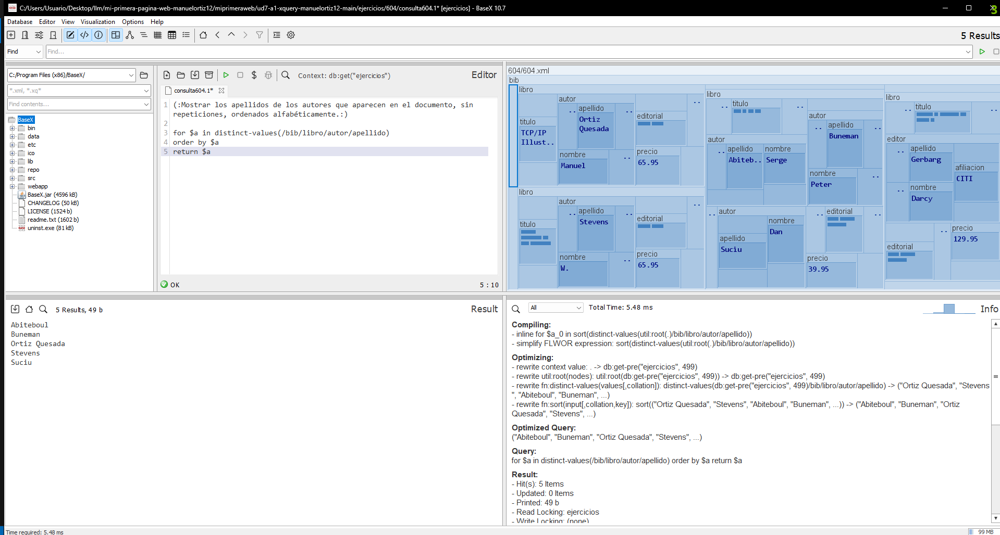
  - [consulta2](ejercicios/604/consulta604.2)
    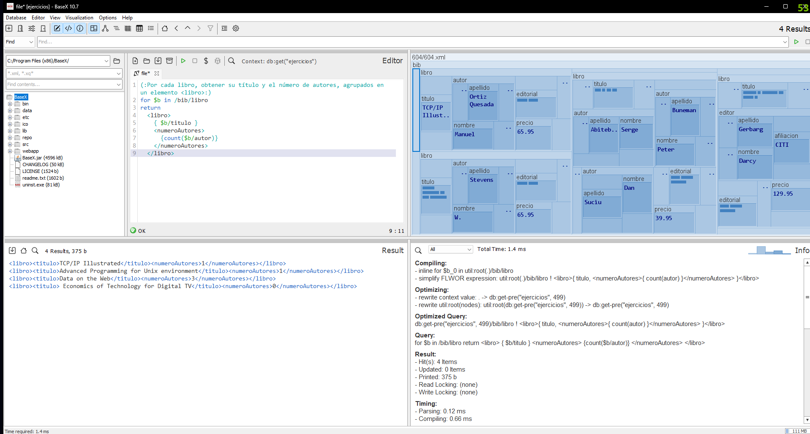
- 605 -> [xml](ejercicios/605/605.xml)
  - [consulta1](ejercicios/605/consulta605.1)
    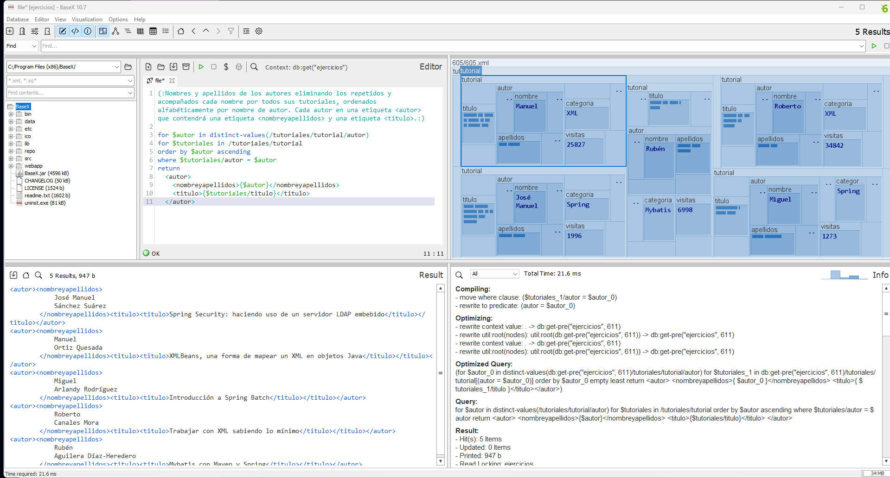
  - [consulta2](ejercicios/605/consulta605.2)
    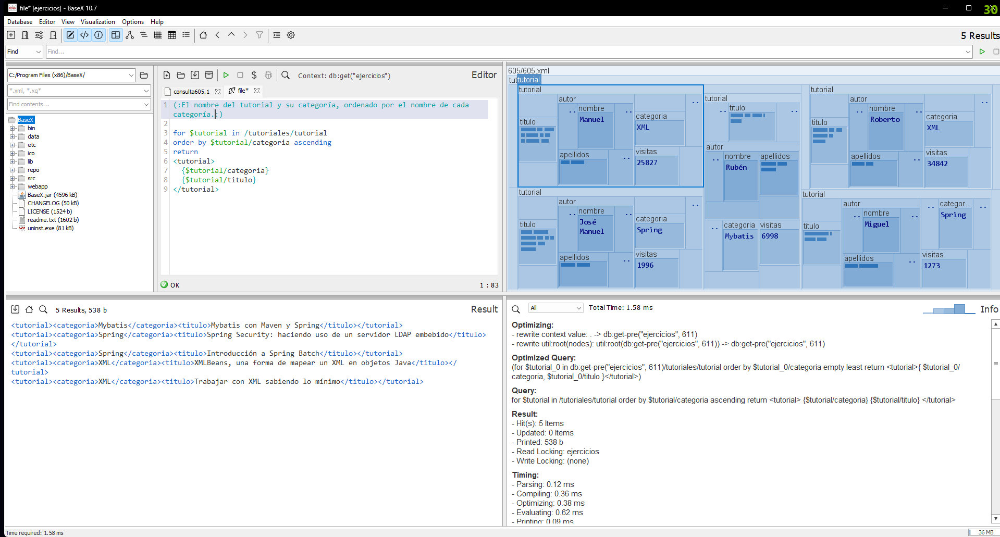
- 606 -> [xml](ejercicios/606/606.xml)
  - [consulta1](ejercicios/606/consulta606.1)
    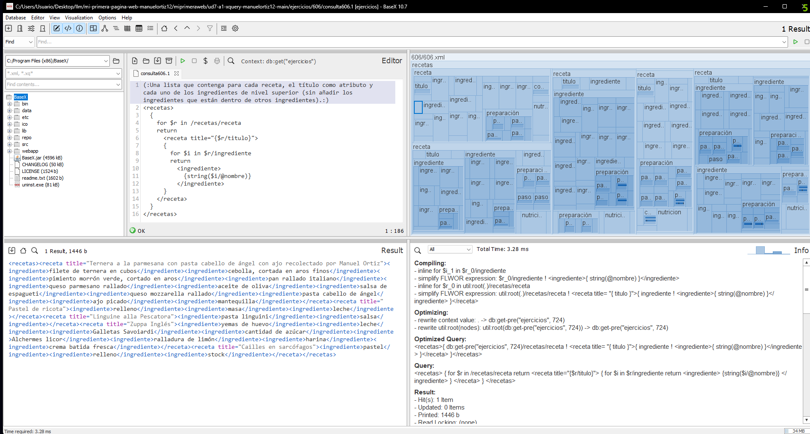
  - [consulta2](ejercicios/606/consulta606.2)
    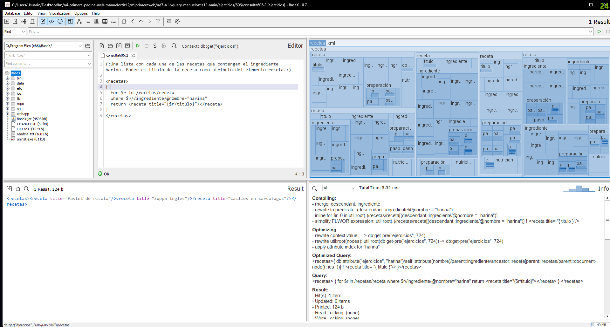


A continuación referencia en el código:
- funciones utilizadas (mínimo de 5)
- función original e invocación
- dos for en la misma consulta
- un for y un let en la misma consulta
- una ordenación

De interés:
- https://www.w3schools.com/xml/xquery_intro.asp
- https://mp0373-lmsxi.vercel.app/docs/unidades/06/
- https://youtu.be/rY7CJgq67xc
- https://youtu.be/lnVLbrTrXpo?list=PLaxZkGlLWHGV7_2FWz_mk7ias1p_ZG3YV

